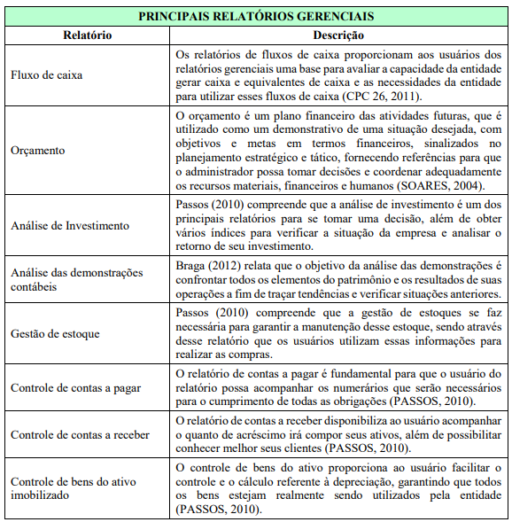
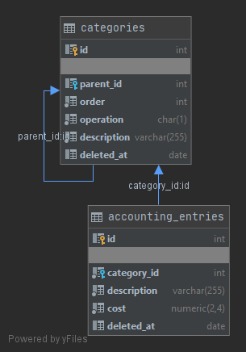
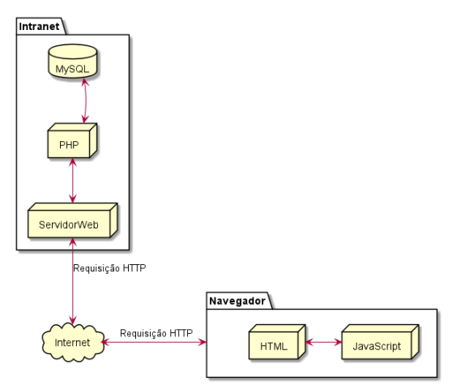

# TG1 - 5º semestre de BD

 

Professor da Disciplina: Giuliano Bertoti 

 

# TG

 

Aluno: José Nicodemos Maia Neto - 1460281423021
Orientador: nome

 

Título do TG: (título)

## 1. Introdução

Segundo FAYYAD (1996, p. 10), as maiorias das Empresas têm como dificuldade ter acesso às informações para tomada de 
decisão, fazendo assim que com o atraso de tal não se tenha tanta confiabilidade no produto final. A análise devido ao 
grande volume de dados torna-se uma atividade difícil e trabalhosa. Sendo assim, fica expressiva a necessidade de criar 
novas ferramentas ou técnicas que auxiliem automaticamente, de maneira eficaz, os seres humanos nesta atividade ou 
análise. Visando a confiabilidade e as necessidades do cliente, foi desenvolvido um software que, busca apresentar as 
informações Gerenciais de modo a facilitar a real tomada de decisão.
Utilizando o X, como processo de transformação de fatos geradores em informações e tendo como foco principal a tomada 
de decisões por intermédio de relatórios Gerenciais, a Diretoria e Corpo Acionário terão em mãos total acolhimento de 
dados para assim determinar qual caminho deverão tomar.
Desta forma, este trabalho de graduação tem como objetivo criar um sistema web onde, serão alimentados dados 
Administrativos, Contábeis, Compras, Financeiros, Fiscais, Logísticos, Operacionais e de Recursos Humanos, que serão 
alocados em um banco de dados MySQL e uma aplicação baseada em LARAVEL. O processo de transformação de dados em 
Relatórios Gerenciais será utilizado como foco principal para tomada de decisões.
 
### 1.1. Definição do problema

Ambientes corporativos são sistemas orgânicos e influenciáveis a diversos fatores, como: relacionamento, cliente, 
infraestrutura, meio ambiente, entre outros (CHIAVENATO, 2003). A pesquisa anual do PortalERP, um dos principais canais 
de informação sobre sistemas de gestão no país, realizada em janeiro de 2017 junto a mais de 4.000 empresas, catalogou 
os 60 sistemas gerenciais mais usados no país e constatou que as empresas brasileiras usam mais de 320 sistemas de 
gestão diferentes. O nicho de Pequenas empresas hoje utiliza meios de controles arcaicos como Excel, Word, e Livros 
Contábeis fazendo com que o resgate de informações para a tomada de decisões não seja fidedigno e sujeito a erros. 
Segundo PEREIRA & FONSECA (1997, p.241) “Os sistemas de informação são mecanismos de apoio à gestão, desenvolvidos com 
base na tecnologia da informação e como suporte da informática para atuar como condutores das informações que visam 
facilitar, agilizar e otimizar o processo decisório nas organizações”.
Este tema problematiza-se a partir de uma necessidade de que, as Pequenas Empresas que estão presas a um sistema 
arcaico de informações, não tem capital para comprar ou alugar um software que supra suas necessidades de entrega de 
relatórios para tomada de decisões, ou seja, determinar qual caminho aquela empresa deve seguir para se manter 
competitiva.

### 1.2. Objetivo

Este trabalho tem por objetivo desenvolver um software que realizara relatórios gerenciais por intermédio da linguagem 
PHP visando simplificar a tomada de decisões.

## 2. Fundamentação

### 2.1 História da Contabilidade

No início do século XIX e teve como seu princípio a busca pelas doutrinas pelo objeto de estudo contábil. Foi nesta 
época que ensinamentos adversos ao comtismo, “considerada a primária Escola do pensamento contábil”, trouxe uma noção 
muito mais ampla da Ciência Contábil, a ciência a qual conhecemos agora. Com o surgimento das Escolas de Pensadores 
Contábil na qual se destacaram: Materialismo Substancial, Personalismo, Controlismo, Reditualismo, Aziendalismo, 
Patrimonizalismo. (e-book DOUTRINA CIENTÍFICA DA CONTABILIDADE, ACESSO EM 07/04/20). 

No século XVII onde Pascal já teria inventado a calculadora, a Contabilidade ainda era confundida com a ciência da 
administração, e o patrimônio segundo os postulados jurídicos se definia como um direito. Nesta época a Contabilidade 
já era uma formação acadêmica nas Faculdades Italianas, recompensadas pelos seus estudos na área Contábil, Francesco 
Villa veio a se tornar Cadeira acadêmica e modificou os conceitos tradicionais de contabilidade, segundo os quais 
escrituração e guarda livros poderiam ser feitas por qualquer pessoa com um pouco de inteligência. 

A tratativa Aziendalista trazia a premissa de que a Contabilidade é o elemento fundamental, de que a Contabilidade é 
mais do que um registro, é um instrumento básico de gestão. Entretanto a escola Europeia teve peso excessivo da teoria, 
sem demonstrações práticas, sem pesquisas fundamentais. A exploração teórica das contas e o uso exagerado das partidas 
dobradas, inviabilizando, em alguns casos, a flexibilidade necessária, principalmente, na Contabilidade Gerencial, 
preocupando-se demais em demonstrar que a Contabilidade era uma ciência ao invés de dar vazão à pesquisa séria de campo 
e de grupo.

Assim ficou marcado o período científico, como a era do pensamento, importantíssimo para evolução histórica da 
contabilidade a partir de uma busca constante de se alçar a Contabilidade na direção de um objeto de estudo. As escolas 
dos pensamentos e suas doutrinas que vimos aqui, como ponto marcante desta época, tiveram grande expressão na resolução 
de questões cientificas da contabilidade. Época de grandes pensadores para grandes descobertas.

Após o período considerado romântico da contabilidade que foi a era científica, a contabilidade busca novas teorias e 
sua evolução cada vez mais exigente diante das necessidades começam a transparecer defeitos nas teorias oriundas da 
escola Europeias, fragilizada pela falta de pesquisas, preocupação demasiada pelas demonstrações que a contabilidade é 
ciência, uso exagerado das partidas dobradas e outros fatores.

### 2.1.1. Plano de Contas

Plano de Contas é o conjunto de contas criado pelo contador, para atender às necessidades de registro dos fatos 
administrativos, de forma a possibilitar a construção dos principais relatórios contábeis e atender a todos os usuários 
da informação contábil. SÁ (1988, p.15) define o plano de contas como sendo:

“...uma peça da técnica contábil que estabelece previamente a conduta a ser adotada na escrituração, através da 
exposição das contas em seus títulos, funções, funcionamento, grupamentos, análises, derivações, dilatações e reduções. 
É um conjunto de normas e intitulação de contas, previamente estabelecido, destinado a orientar os trabalhos da 
escrituração contábil...”.

Com isso, conclui-se que quando há a necessidade de elaborar um plano de contas, deve-se ter em mente que alguns 
quesitos importantes devem ser respeitados, como atender os objetivos e premissas do sistema de apuração em questão, 
possuindo uma classificação que parta dos grupos mais genéricos para os mais específicos, utilizando a terminologia que 
indique com clareza os recursos envolvidos, e além, é claro, ter flexibilidade suficiente para possíveis alterações 
futuras, para que os resultados gerados por esta ferramenta sejam reais e que demonstrem a verdade sobre o patrimônio 
das empresas.

### 2.1.2. DRE

A DRE é um demonstrativo contábil cuja finalidade é fornecer o resultado líquido de um exercício evidenciando o 
confronto das receitas, custos e despesas, é apurado através do princípio contábil do regime de competência onde “as 
receitas e as despesas devem ser incluídas na apuração do resultado do período em que ocorreram, sempre simultaneamente 
quando se correlacionam, independente de recebimento ou pagamento” (CFC, 1993 p.7).

De acordo com IUDÍCIBUS (2004), Demonstração do Resultado do Exercício é o relatório que traz o resumo parametrizado 
das receitas e despesas de uma empresa em determinado período, é apresentado de uma forma em que as receitas subtraem 
as despesas gerando um lucro ou prejuízo. Para MARION (2009), a DRE é um demonstrativo contábil que gera informações 
relevantes através do confronto de despesas e receitas para a tomada de decisão, tendo como uma das principais funções 
confrontar todas as despesas realizadas, assim como as receitas que foram recebidas pela empresa no ano em questão. 
Sendo assim, se tornando uma forma de especificar todas as operações uma a uma, dentro dos grupos de contas 
patrimoniais a que pertencem.

Segundo MARION (2003, p. 127) “A DRE é extremamente relevante para avaliar desempenho da empresa e a eficiência dos 
gestores em obter resultado positivo. O lucro é o objetivo principal das empresas”

### 2.1.3. Relatórios Gerencias (Contabilidade de Custos)

De acordo com PADOVEZE (2015), as disponibilizações de informações contábeis a todos os usuários por meio dos 
relatórios gerenciais, são frutos do sistema de informação contábil e têm como finalidade, disponibilizar à 
administração da empresa dados adequados ao controle geral de suas operações e à tomada de decisões.

Compreende-se que os relatórios gerenciais são ferramentas para que o gestor tenha bases importantes para tomar 
decisões, além de construírem estratégias para os negócios, esses relatórios devem estar de acordo com a estrutura 
utilizada no plano de conta (PADOVEZE, 2015).

SANT’ANA (2014) compreende que a maior dificuldade para se obter um relatório gerencial é a transformação das 
informações contábeis em algo mais compreensível para os usuários, para que possam se tornar informações úteis. Um 
fator que pode afetar a geração da informação é a grande variação entre os dados e as informações, pois tanto no 
volume como a qualidade da informação, podem prejudicar o resultado que entidade almeja.

Fonte: BRAGA (2012), CPC 26 (R1) (2011), PASSOS (2010), SOARES (2004), ADAPTADO PELO AUTOR (2020).

### 2.2. Banco de Dados

SILBERSCHATZ E KORTH (2006) definem um SGBD (Sistema Gerenciador de Banco de Dados) como uma coleção de dados 
inter-relacionados e também de programas utilitários que são utilizados para acesso e manipulação a estes dados. A 
principal função do SGBD é proporcionar um ambiente conveniente e eficiente para recuperação e armazenamento das 
informações.

### 2.3. Banco de Dados Relacionais

Banco de Dados (BD) é um conjunto integrado de dados que tem por objetivo atender as necessidades específicas de uma 
comunidade de usuários (SILBERSCHATZ et al. 1999). Sendo assim hoje o banco de dados é considerado o novo petróleo da 
atualidade. 
Segundo DATE (2004, p. 10), “Um banco de dados é uma coleção de dados persistentes, usada pelos sistemas de aplicação 
de uma determinada empresa”.  Um banco de dados, em outros termos, é um lugar onde é retido dados imprescindíveis as 
atividades de determinada organização, programas não contêm todo o código referente a exibição dos dados na interface, 
para isso utilizam-se gerenciadores de interface onde contíguos de rotinas, funcionalidades que um programador depender 
para desenvolver a interface de usuário. 

### 2.4. MySQL

MySQL é um banco de dados, e este banco de dados é conhecido por sua facilidade de uso. Sua interface simples, e também 
sua capacidade de rodar em vários sistemas operacionais, são alguns dos motivos para este programa ser tão usado 
atualmente, e seu uso estar crescendo cada vez mais.

### 2.5. PHP/LARAVEL

O framework utilizado para o desenvolvimento deste trabalho foi o Laravel. A primeira versão dele foi lançada em 2011 e 
nos últimos anos o framework evoluiu rapidamente, se tornando bastante popular entre os desenvolvedores PHP. Assim como 
grande maioria dos frameworks para aplicações web, o Laravel também segue o padrão MVC. Ele é open-source e, embora 
seja extremamente poderoso, possui uma curva de aprendizado bem pequena. Isso se dá pelo fato dele possuir uma 
linguagem bastante expressiva, além de simplificar a execução de diversas tarefas necessárias durante o desenvolvimento 
de aplicações web. Uma das grandes vantagens do Laravel é a criação de migrations, que basicamente são um controle de 
versão para o banco de dados da aplicação. Deste modo, fazer modificações na estrutura do banco de dados e 
compartilhamento do mesmo entre desenvolvedores se torna algo extremamente simples de ser feito.

### 2.6. HTML

HTML significa Hyper Text Markup Language e é a linguagem de descrição de documentos usada na Web. A linguagem utiliza 
tags para definir os diferentes elementos, tais como texto, elementos multimídia, formulários, hiperlink, etc. Ao abrir 
uma página de site na internet, o usuário tem acesso direto com informações HTML, pois o navegador interpreta o 
documento, e o resultado final é mostrado na tela.

### 2.7. JavaScript

JavaScript é uma linguagem de programação com alguns recursos de orientação a objetos, é usado em sites para deixar a 
página HTML mais dinâmica, ou seja o JavaScript tem o poder de em tempo de execução criar mais tags HTML e exibir no 
navegador sem que a pagina tenha que ser atualizada.

## 3. Desenvolvimento

O sistema desenvolvido denominado X é um sistema em PHP robusto que utiliza diversos recursos como: como PHP, Laravel, 
MySQL, Javascript, Bootstrap e REST.
As tecnologias serão apresentadas em detalhe no próximo tópico vide arquitetura da solução.

### 3.1. Modelagem do Banco de Dados

### 3.2. Arquitetura da Aplicação

A Figura 1 ilustra todos os componentes utilizados e como interagem entre si.

**Figura 1 – Arquitetura Global.**

Fonte: Autor (2020).

#### 3.2.1. Dados

Os dados extraídos de lançamentos contábeis, tem como padrão organizacional o plano de contas, que determina as 
Receitas e Despesas da Empresa. Este plano de contas é determinado por Hierarquia que é dividido em 1.0 – Ativos, 
2.0 – Passivos, 3.0 – Despesas e 4.0 – Outras Receitas e Despesas conforme planilha abaixo:

## 4. Referencial Bibliográfico

FAYYAD, U. M. et al. Advances in knowledge discovery and data minig. Massachusetts: The MIT Press, 1996.

CHIAVENATO, Idalberto. Introdução à Teoria Geral da Administração. São Paulo, 6a. ed. - Editora Campus, Rio de Janeiro 
2003

PEREIRA, M. J. L. B.; FONSECA, J. G. M. Faces da decisão. as mudanças de paradigmas e o poder da decisão. São Paulo. 
Makron Books, 1997.

LOPES, André Charone Tavares. Temas da Doutrina Científica da Contabilidade. Coletânea de Artigos - Publicher. 2013.

Iudicibus, Sergio de.;TEORIA DA CONTABILIDADE - 7ªED.(2004).editora: Atlas.

MARION, José Carlos. Contabilidade básica. 10 ed. São Paulo: Atlas, 2009 a.

MARION, José Carlos. Contabilidade Empresarial. 10. Ed. São Paulo: Atlas, 2003. 

PADOVEZE C. L. Sistemas de informações contábeis: fundamentos e análise. 7. ed. São
Paulo: Atlas, 2015.

SANT’ANA, J. V. Elaboração de relatórios gerenciais informação de qualidade para
gestores. dez. 2014. Disponível em: 
<http://www.cienciascontabeis.com.br/elaboracao-de-relatorios-gerenciais-informacao-de-qualidade-para-gestores/>. 
Acesso em: 06 jul. 2020.

Silberschatz, Abraham S. Sudarshan e Henry F. Korth. idioma: Português, Português do Brasil. Edição: Editora Campus, 
janeiro de 2006 ‧ ISBN

SILBERSCHATZ, Abraham; KORTH, Henri F, & SUDARSHAN S. Sistemas de Banco de Dados. São Paulo: MAKRON BOOKS, 1999. 

DATE, C. J.. INTRODUÇÃO A SISTEMAS DE BANCOS DE DADOS. 8. ed. Rio de Janeiro: Elsevier, 2003.

---

### Entregas

#### 1ª Quinzena de maio

 

(coloque aqui tudo que você fez referente ao capítulo 1 no formato exato de BD)

 

#### 2ª Quinzena de maio

 

(coloque aqui tudo que você fez referente ao capítulo 2 no formato exato de BD)

 

#### 1ª Quinzena de junho
 
(coloque aqui tudo que você fez referente ao capítulo 3 no formato exato de BD)

 

#### 2ª Quinzena de junho

 

(coloque aqui tudo que você fez referente ao capítulo 3 no formato exato de BD) + crie um pasta chamada "Desenvolvimento" e coloque o início do código

 

#### 1ª Quinzena de julho

 

(coloque aqui tudo que você fez referente ao capítulo 3 no formato exato de BD) + atualize a continuação do código
